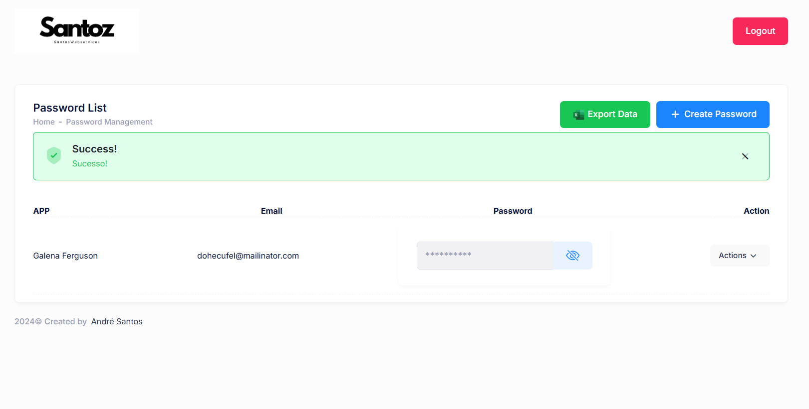

# **password Genius**

This was a mini project that I developed to learn a little more vanilla php, I started directly in laravel and I feel like I was missing some bases.
Even though I haven't mastered the language yet, I feel that this project has helped me enough, also due to the fact that I haven't used practically any AI.

## Screenshots

## Stack used

**Front-end:** HTML,CSS,Bootstrap

**Back-end:** VANILLA PHP, MySQL 

## Features

- Login / Register System
- Generate Password
- Manage Password
- Export Password to .CSV File

## features not implemented

- Email Verification
- Recover Password
- Admin Panel

## installation

- You only need to import the repository database!
## License

Adicione etiquetas de algum lugar, como: [shields.io](https://shields.io/)

